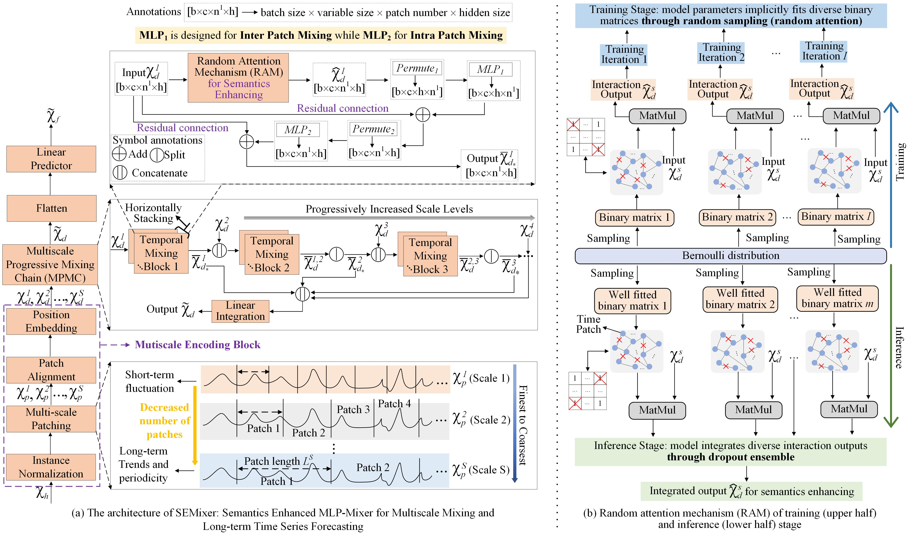

# SEMixer: Semantics Enhanced MLP-Mixer for Multiscale Mixing and Long-term Time Series Forecasting (In ACM Web Conference 2026, WWW 2026)
This work further improves upon LSINet [Paper (PDF)](https://arxiv.org/pdf/2602.01585) by optimizing the interaction mechanism, replacing the multi-head sparse interaction mechanism with a random attention mechanism to enhance both efficiency and performance. In addition, a progressive multi-scale interaction chain is introduced to further improve prediction accuracy. SEMixer enhances the ability to learn temporal representations by strengthening patch-level semantics. 

The paper can be available here [Paper (PDF)](https://arxiv.org/pdf/2602.16220).

## Datasets
  You can download the public datasets used in our paper from https://drive.google.com/drive/folders/1PPLsAoDbv4WcoXDp-mm4LFxoKwewnKxX. The downloaded folders e.g., "ETTh1.csv",  should be placed at the "dataset" folder. These datasets are extensively used for evaluating performance of various time series forecasting methods.

## Overview




- We propose an end-to-end lightweight multiscale model, SEMixer, for long-term forecasting. Due to meticulous model design, SEMixer can handle longer input sequences and achieve better performance from longer inputs.

- We propose the Random Attention Mechanism (RAM), which learns diverse interactions through random sampling during training and integrates them for enhancing the semantics of time patches through dropout ensemble, resulting in higher efficiency and better forecasting performance.

- We propose the Multiscale Progressive Mixing Chain (MPMC) to progressively stack the RAM and MLP-Mixer backbone as the TS scale level increases, and make them only work in the pairwise concatenation of adjacent scales. This not only facilitates better forecasting performance due to considering the semantic gaps among different scales, but also results in low memory usage because MLP-Mixer does not need to process all scale inputs at once. We also observe that MPMC helps to resist noise.

## Reference
If this repository and the work are helpful to you, please consider citing it:

```
@article{zhang2026semixer,
  title={SEMixer: Semantics Enhanced MLP-Mixer for Multiscale Mixing and Long-term Time Series Forecasting},
  author={Zhang, Xu and Wang, Qitong and Wang, Peng and Wang, Wei},
  journal={arXiv preprint arXiv:2602.16220},
  year={2026}
}
```

```
@inproceedings{zhang2025lightweight,
  title={A lightweight sparse interaction network for time series forecasting},
  author={Zhang, Xu and Wang, Qitong and Wang, Peng and Wang, Wei},
  booktitle={Proceedings of the AAAI Conference on Artificial Intelligence},
  volume={39},
  number={12},
  pages={13304--13312},
  year={2025}
}
```


  
