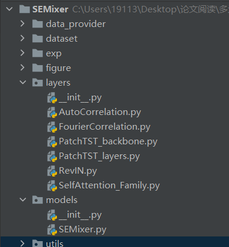
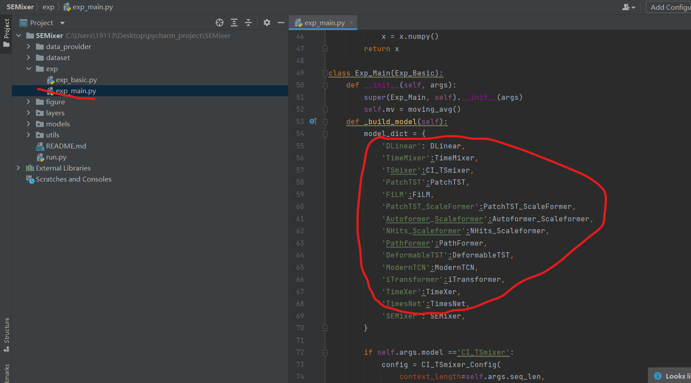
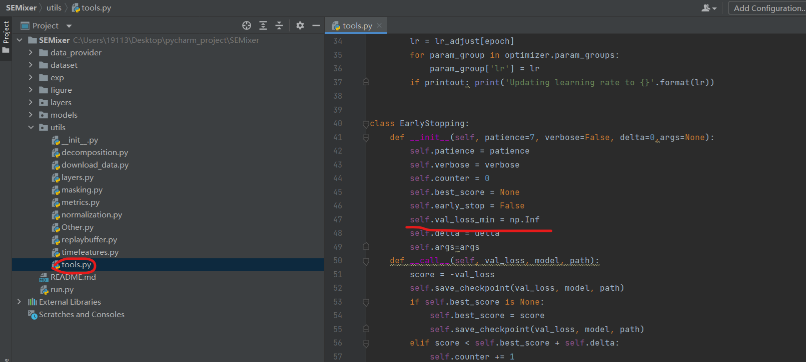
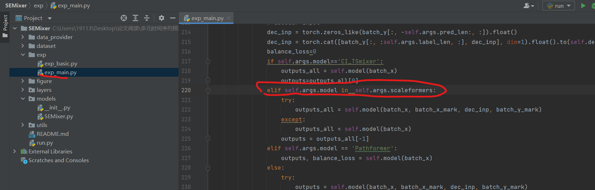
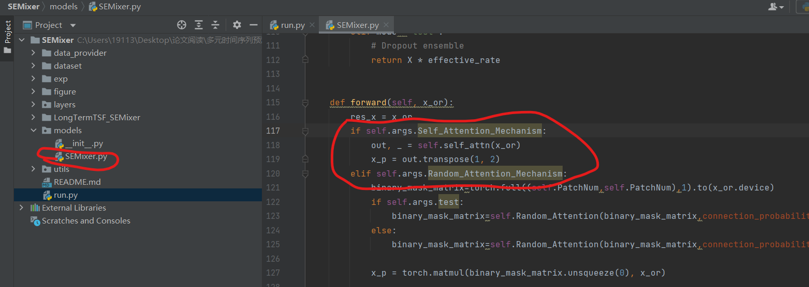

本项目是多元时间序列预测的SEMixer模型的调试跑通

参考链接[SEMixer](https://github.com/Meteor-Stars/SEMixer/tree/master)

## 1.环境配置

项目目录
```
/SEMixer
|
|---data_provider/ #里面两个是数据集的加载方式 
|
|---dataset/ #里面存放的是数据 .csv和.txt文件
|
|---exp/ #存放着训练的核心代码
|
|---layers/  #存放着组成各个模型的模块
|
|---models/ #存放着每个模型（作者对比了很多模型，但是作者没写全，后续需要进行删除）
|
|---utils/ #存放着函数工具包
|
|---run.py #运行代码和超参数设置


```
### 1.多余文件删除
由于该项目集成了很多模型，导致原作者在写这些模型的时候有些模型残缺了，而在源代码中，作者是加载了所有的模型，所以会导致报错，这时如果是跑论文的模型SEMixer，则需要在models和layers文件夹下去去掉不相关的文件，只剩下以下相关的,如下图： 
<br/><br/>


<br/><br/>

因为代码有一段是初始化，由于将其他模型给删除了，所以初始化会报错误，故需要进行修改（将圈内代码进行删除），如下图：



接下来检查代码，如果发现py文件顶部出现如下错误，请直接进行注释
```
__all__ = ['PatchTST_backbone']
```
### 2.版本不对
在NumPy 2.0+ 版本，该版本移除了 np.Inf（大写的 I），只保留 np.inf（小写的 i），而在SEMixer/utils/tools.py这个文件中，如下图所示：



```
AttributeError: `np.Inf` was removed in the NumPy 2.0 release. Use `np.inf` instead.


NumPy 版本兼容性问题：你的环境中安装了 NumPy 2.0+ 版本，该版本移除了 np.Inf（大写的 I），只保留 np.inf（小写的 i），而代码中仍使用 np.Inf，因此触发 AttributeError。

# 修改后（正确行）
self.val_loss_min = np.inf
```
### 2.运行配置参数不对

运行run.py出现以下错误：
```
AttributeError: 'Namespace' object has no attribute 'scaleformers'
```
这是因为在代码缺少了一个参数，就是 `args.scaleformers`,因为在代码中有判断模型是不是属于这个列表，代码位于`exp/exp_main.py`。如下图：


只需要在run.py中新增一行就可以解决问题：
```
args.efficient_comp=False
args.root_path='./dataset/'
args.data_type='ETTh1'
args.model='SEMixer'
args.scaleformers = ['x']  # <--- 新增这一行
args.reduce_dim = 64
```
为什么是`args.scaleformers = ['x']`，因为`SEMixer`模型使用的训练代码是后面的（Gemini说的），不能进入到那个训练代码（除非修改训练代码）

<br/><br/>
继续运行run.py出现以下错误：
```
AttributeError: 'Namespace' object has no attribute 'Self_Attention_Mechanism'. Did you mean: 'Random_Attention_Mechanism'?
```
问题出现在`models/SEMixer.py`中，因为论文中做了SAM（自注意力机制）和RAM（随机注意力机制）的消融实验，而作者在代码中是先判断了SAM是否存在（如下图），所以需要补上这个参数，

只需要在run.py中新增一行就可以解决问题：
```
args.Random_Attention_Mechanism=True
args.Self_Attention_Mechanism=False  # <--- 新增这一行（通常设为 False，除非你想开启它）
args.self_attn=False
args.prob_attn=False
```


<br/><br/>

最后注意run.py的函数入口是有个稳健性分析（设置了多个种子点，为了调试代码，我直接弄成了一个）

代码会自动保存指标结果以及权重


## 3.环境导出
```
#在命令行输入，得到了我调试代码的环境
conda env export > environment.yml

```

## 4.说明

感谢论文代码的开源
```
@article{zhang2026semixer,
  title={SEMixer: Semantics Enhanced MLP-Mixer for Multiscale Mixing and Long-term Time Series Forecasting},
  author={Zhang, Xu and Wang, Qitong and Wang, Peng and Wang, Wei},
  journal={arXiv preprint arXiv:2602.16220},
  year={2026}
}
```
我的repository也放入了论文的翻译（翻译可能出错，AI翻译），如有理解错误，请见谅！！！！
